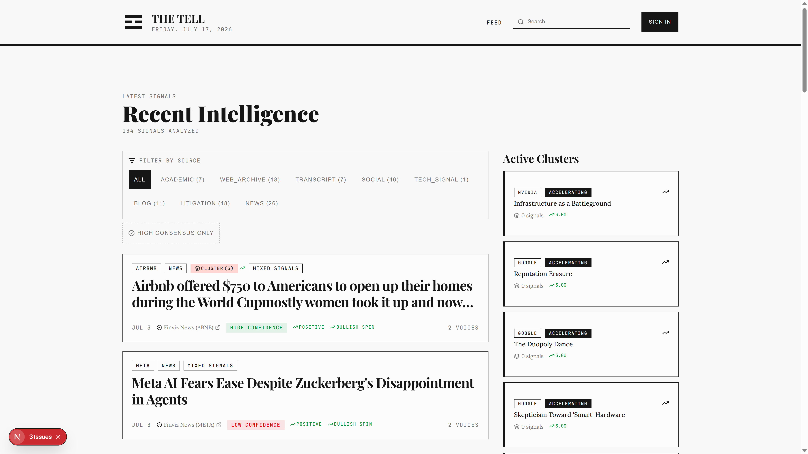
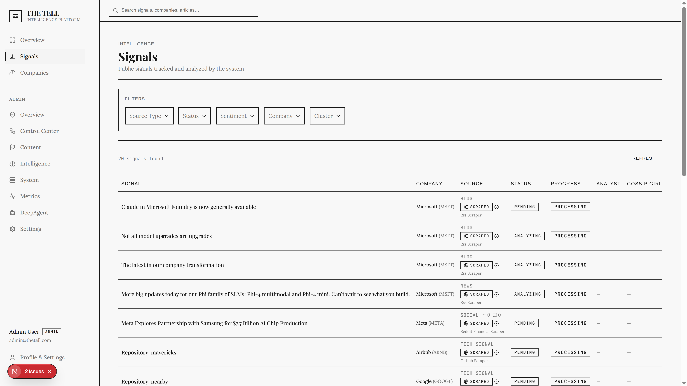
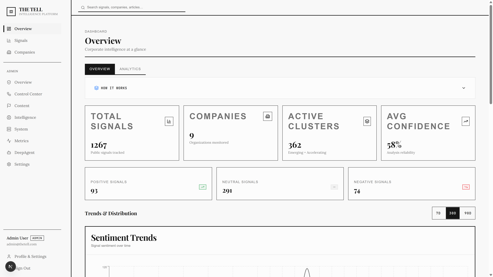
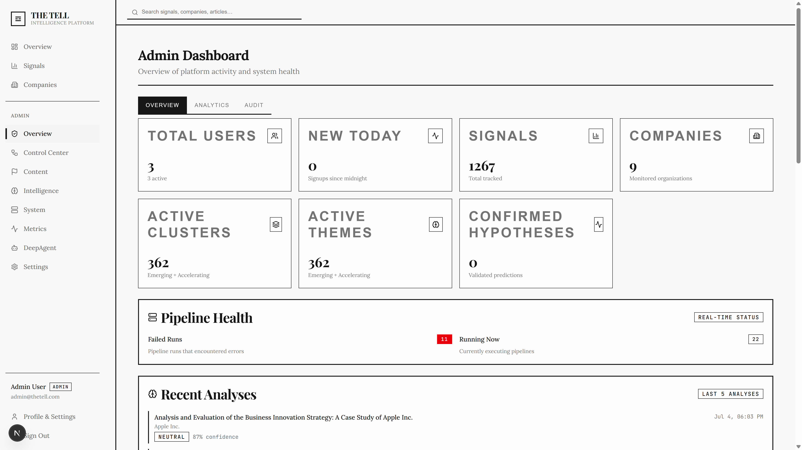
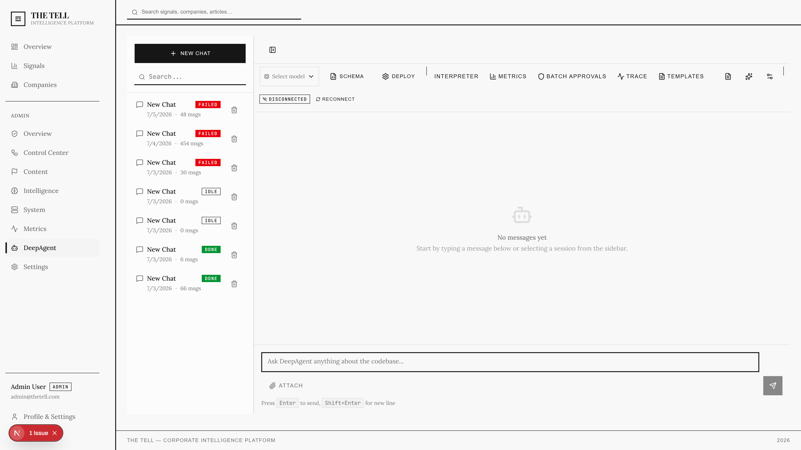

# The Tell

**AI-powered corporate intelligence that reads between the lines of public information.**

The Tell is the only platform that connects the dots across signal types — earnings calls, news, filings, social media, job postings — to predict what companies are really thinking and planning.

---

## Preview

### Public Signal Feed
Real-time signal feed with dual-agent AI analysis, confidence scoring, and strategic theme detection.



### Analyst Dashboard
Filter and search across signals by source type, confidence level, and status.



### Analytics & Trends
Track signal trends, source breakdowns, confidence distributions, and sentiment over time.



### Admin Control Center
Monitor pipeline health, system status, and manage the full signal processing lifecycle.



### DeepAgent — Multi-Agent Debate
Two AI personas (Analyst & Gossip Girl) debate accumulated evidence across signals to refine strategic insights.



---

## Features

- **25+ Signal Sources** — News, SEC filings, earnings transcripts, social media, job postings, patents, government records, Reddit, and more
- **Dual-Agent Analysis** — Two distinct AI personas analyze every signal from different perspectives
- **Cross-Signal Inference** — Connects patterns across signal types to infer corporate strategic intent
- **Confidence Scoring** — Every inference scored (0.0–1.0) so analysts know what to trust
- **NLP Pipeline** — Local embeddings, entity extraction, sentiment classification, keyphrase extraction
- **Hypothesis-Driven Collection** — LLM-generated investigative questions guide targeted signal collection
- **DeepAgent** — Multi-agent debate system that refines analyses through structured argumentation
- **Real-Time Dashboard** — Signal monitoring with filtering, search, and analytics
- **Admin Control Center** — Full pipeline visibility with manual triggers and system health monitoring

## Tech Stack

- **Framework**: Next.js 16 with App Router (Turbopack)
- **Language**: TypeScript (strict mode)
- **Database**: PostgreSQL with Prisma ORM (27 models)
- **AI**: OpenAI / Anthropic provider abstraction
- **NLP**: Transformers.js (local embeddings, no external API)
- **Background Jobs**: Inngest
- **Auth**: NextAuth v5
- **UI**: shadcn/ui + Tailwind CSS
- **Scraping**: Cheerio-based pipeline with rate limiting and caching

## Getting Started

### Prerequisites

- Node.js 20+
- pnpm
- Docker (for PostgreSQL)

### Setup

```bash
# Clone the repository
git clone https://github.com/your-org/the-tell.git
cd the-tell

# Install dependencies
pnpm install

# Start PostgreSQL in Docker
docker-compose up -d db

# Run database migrations
pnpm prisma migrate deploy

# Seed test data
pnpm prisma db seed

# Copy environment template
cp .env.example .env.local
# Edit .env.local with your API keys (API_KEY, BASE_URL, etc.)

# Start the dev server
pnpm dev
```

Open [http://localhost:3000](http://localhost:3000) to view the app.

### Test Credentials

| User | Email | Password | Role |
|---|---|---|---|
| Admin | `admin@thetell.com` | `password123` | `ADMIN` |
| Analyst | `analyst@thetell.com` | `password123` | `USER` |

## Project Structure

```
src/
├── app/                    # Next.js App Router pages & API routes
├── components/             # React components (UI, dashboard, admin)
├── lib/
│   ├── ai/agent/          # Dual-agent analysis pipeline
│   ├── inngest/           # Background job definitions
│   ├── nlp/               # NLP layer (embeddings, entities, sentiment)
│   ├── scraping/          # 25 scrapers + cache + registry
│   ├── enrichment/        # Company enrichment pipeline
│   └── reddit/            # Subreddit discovery
└── hooks/                  # Custom React hooks
```

## License

Private — not yet licensed for distribution.
