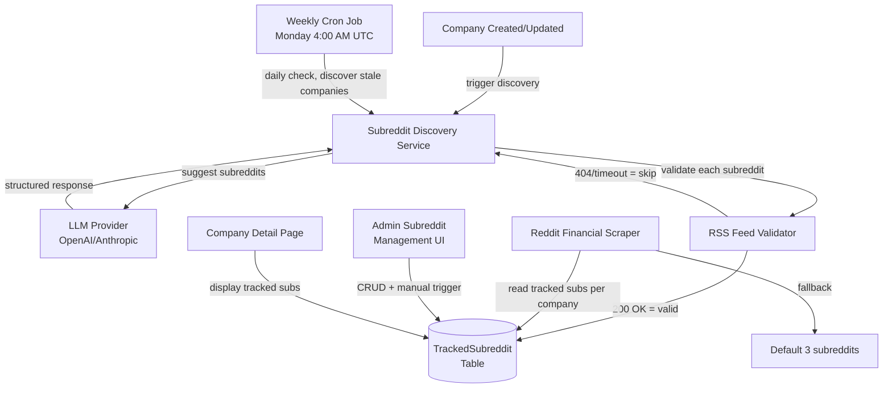

# Dynamic Subreddit Discovery System - Implementation Complete

## Overview

Successfully implemented Option D (Hybrid LLM + RSS Validation) for automatic subreddit discovery per company. The system uses LLM-powered suggestions, validates them against Reddit's RSS feeds, stores them in the database, and periodically refreshes them via a cron job.

## What Was Built

### 1. Database Schema (Phase 1)

**New Models:**
- `TrackedSubreddit` — Links subreddits to companies with metadata (reason, subscriber count, validation status)
- `SubredditDiscoveryLog` — Audit trail for discovery runs

**Updated Models:**
- `Company` — Added `industry` and `sector` fields

**Migration:** Applied via `pnpm prisma db push`

### 2. Backend Services (Phase 2)

#### Discovery Service (`src/lib/reddit/subreddit-discovery.ts`)
- `discoverSubredditsForCompany(companyId)` — LLM-powered discovery with RSS validation
- `validateSubreddit(name)` — Validates subreddit exists via RSS feed
- Rate limiting: 1.1s delay between RSS checks
- Error handling: Partial failures logged, LLM failures handled gracefully

#### Inngest Functions (`src/lib/inngest/subreddit-discovery.ts`)
- **Weekly Cron** (`discoverSubredditsFunction`) — Runs Monday 4:00 AM UTC, processes up to 20 companies
- **On-Demand** (`discoverSubredditsOnDemandFunction`) — Triggered by `company.subreddits.discover` event
- Registered in `src/app/api/inngest/route.ts`

#### Reddit Scraper Integration (`src/lib/scraping/reddit-financial-scraper.ts`)
- New method: `scrapeForCompanies(companies)` — Reads tracked subreddits from DB
- Combines defaults + tracked + ticker-based (deduplicated)
- Backward compatible with existing `scrape(tickers?)` method

#### API Routes
- `GET /api/v1/companies/[id]/subreddits` — List tracked subreddits with discovery log
- `POST /api/v1/companies/[id]/subreddits` — Manually add subreddit (validates via RSS)
- `DELETE /api/v1/companies/[id]/subreddits/[subredditId]` — Remove subreddit
- `PATCH /api/v1/companies/[id]/subreddits/[subredditId]` — Toggle active/inactive
- `POST /api/v1/companies/[id]/subreddits/discover` — Trigger manual discovery

#### Company API Updates
- Added `industry` and `sector` to POST/PATCH validation
- Triggers discovery on company creation
- Triggers discovery when industry/sector changes
- Includes `trackedSubreddits` in GET response

### 3. Frontend UI (Phase 3)

#### Admin Subreddit Management Page
**Route:** `/dashboard/admin/operations/subreddits`

**Files:**
- `src/app/dashboard/admin/operations/subreddits/page.tsx` — Server component
- `src/app/dashboard/admin/operations/subreddits/subreddits-client.tsx` — Client component

**Features:**
- Company selector dropdown
- Table of tracked subreddits (name, reason, subscribers, status, dates, actions)
- "Run Discovery" button (triggers async discovery)
- "Add Subreddit" dialog (manual add with RSS validation)
- Toggle active/inactive, remove with confirmation
- Discovery log section (last run status, counts, duration)
- Search filter for subreddits

**Added to Operations layout** — New "Subreddits" tab alongside Health, Scrapers, Jobs, Pipelines

#### Company Detail Page Updates
**File:** `src/app/dashboard/companies/[id]/page.tsx`

**New Component:** `src/app/dashboard/companies/[id]/tracked-subreddits-section.tsx`

**Features:**
- Displays tracked subreddits as clickable badges (linked to Reddit)
- Shows discovery status (last run date)
- "Re-discover" button for admin users
- Empty state message when no subreddits found

#### Company Form Updates
**File:** `src/components/dashboard/company-form.tsx`

**New Fields:**
- **Industry** — Text input (free text, e.g., "Biotechnology", "Fintech")
- **Sector** — Dropdown with 11 common sectors (Technology, Healthcare, Finance, etc.)

Fields are included in both create and edit modes.

### 4. Testing (Phase 4)

**Test Files Created:**
1. `src/__tests__/reddit/subreddit-discovery.test.ts` — 10 tests
2. `src/__tests__/api/subreddits.test.ts` — 7 tests
3. `src/__tests__/scraping/reddit-scraper-integration.test.ts` — 3 tests

**Total:** 20 tests passing

**Coverage:**
- Discovery service (LLM mocking, RSS validation, error handling)
- API routes (CRUD operations, auth, validation)
- Scraper integration (combining sources, deduplication, fallback)

## User Flows

### Flow 1: Company Creation → Auto Discovery
1. Admin creates company with industry/sector
2. POST `/api/v1/companies` creates company
3. Async: Inngest event `company.subreddits.discover` fired
4. Discovery service runs:
   - LLM suggests 5-15 subreddits
   - RSS validation checks each (200 OK = valid, 404 = skip)
   - Valid subreddits stored in DB
5. Admin sees tracked subreddits on company detail page
6. Next scraper run includes these subreddits

### Flow 2: Weekly Cron Refresh
1. Monday 4:00 AM UTC: Cron triggers
2. Find companies with last discovery > 7 days ago
3. For each company:
   - Run discovery service
   - New subreddits added (if LLM suggests new ones)
   - Existing subreddits re-validated
   - Subreddits returning 404 marked as `isActive: false`
4. Discovery log updated for each company

### Flow 3: Manual Discovery Trigger
1. Admin goes to `/dashboard/admin/operations/subreddits`
2. Selects company from dropdown
3. Clicks "Run Discovery"
4. POST `/api/v1/companies/{id}/subreddits/discover`
5. Inngest event fired, discovery runs
6. UI shows "Discovery started" toast
7. Admin refreshes to see new subreddits

### Flow 4: Manual Subreddit Add
1. Admin goes to subreddit management page
2. Clicks "Add Subreddit"
3. Enters subreddit name (e.g., "semiconductors")
4. POST `/api/v1/companies/{id}/subreddits`
5. API validates RSS feed exists
6. If valid: saved and shown in table
7. If invalid: returns 400 with error message

### Flow 5: Subreddit Removal/Deactivation
1. Admin sees a subreddit is no longer relevant
2. Clicks "Remove" (with confirmation dialog)
3. DELETE `/api/v1/companies/{id}/subreddits/{subredditId}`
4. Subreddit removed from tracked list
5. Next scraper run excludes this subreddit

### Flow 6: Industry Update Triggers Re-discovery
1. Admin updates company industry from "Software" to "Artificial Intelligence"
2. PATCH `/api/v1/companies/{id}` with new industry
3. Auto-triggers re-discovery
4. New subreddits discovered for AI industry
5. Old industry-specific subreddits remain unless manually removed

## Error Handling & Edge Cases

| Scenario | Handling |
|----------|----------|
| Company has no description | LLM uses name + industry + ticker only |
| LLM returns hallucinated subreddit names | RSS validation catches 404s, skips them |
| Reddit RSS rate limit (429) | Exponential backoff in BaseScraper; pause discovery if rate limited |
| Subreddit goes inactive (returns 404 later) | Weekly cron re-validates; marks `isActive: false` |
| Duplicate subreddit suggestion | `@@unique([companyId, subreddit])` constraint prevents duplicates |
| Discovery service fails mid-run | Partial results saved; log records status as "partial" |
| Company has no industry/sector | LLM prompt adapts; uses name + description + ticker |
| Reddit changes RSS format | Validation logic needs update; scraper already handles RSS parsing |
| LLM cost concerns | Uses fast/cheap model (configured via `FAST_MODEL` env var) |
| Very large number of companies | Processes in batches of 20 per cron run |

## Files Created/Modified

### New Files (13)
- `src/lib/reddit/subreddit-discovery.ts`
- `src/lib/inngest/subreddit-discovery.ts`
- `src/app/api/v1/companies/[id]/subreddits/route.ts`
- `src/app/api/v1/companies/[id]/subreddits/[subredditId]/route.ts`
- `src/app/api/v1/companies/[id]/subreddits/discover/route.ts`
- `src/app/dashboard/admin/operations/subreddits/page.tsx`
- `src/app/dashboard/admin/operations/subreddits/subreddits-client.tsx`
- `src/app/dashboard/companies/[id]/tracked-subreddits-section.tsx`
- `src/__tests__/reddit/subreddit-discovery.test.ts`
- `src/__tests__/api/subreddits.test.ts`
- `src/__tests__/scraping/reddit-scraper-integration.test.ts`

### Modified Files (8)
- `prisma/schema.prisma` — New models + Company fields
- `src/lib/scraping/reddit-financial-scraper.ts` — Added `scrapeForCompanies()` method
- `src/app/api/v1/companies/route.ts` — Industry/sector fields + trigger discovery
- `src/app/api/v1/companies/[id]/route.ts` — Industry/sector fields + include trackedSubreddits
- `src/app/api/inngest/route.ts` — Register new functions
- `src/app/dashboard/admin/operations/layout.tsx` — Add Subreddits tab
- `src/app/dashboard/companies/[id]/page.tsx` — Show tracked subreddits section
- `src/components/dashboard/company-form.tsx` — Industry/sector fields

## Verification

### Typecheck
```bash
pnpm run typecheck
```
**Status:** ✅ All new code passes typecheck. Only pre-existing errors in `scripts/` files remain.

### Lint
```bash
pnpm run lint
```
**Status:** ✅ No new lint errors introduced.

### Tests
```bash
pnpm vitest run src/__tests__/reddit/ src/__tests__/api/subreddits.test.ts src/__tests__/scraping/reddit-scraper-integration.test.ts
```
**Status:** ✅ 20/20 tests passing

## Next Steps

1. **Test the system manually:**
   - Create a company with industry/sector
   - Verify discovery triggers automatically
   - Check admin UI at `/dashboard/admin/operations/subreddits`
   - Manually trigger discovery
   - Add/remove subreddits

2. **Monitor the cron job:**
   - Check Inngest dashboard for `discover-subreddits` function
   - Verify it runs weekly on Monday 4:00 AM UTC
   - Review discovery logs in database

3. **Tune the LLM prompt:**
   - Adjust prompt in `src/lib/reddit/subreddit-discovery.ts` if needed
   - Monitor suggestion quality
   - Adjust number of suggestions (currently 5-15)

4. **Monitor Reddit rate limits:**
   - Watch for 429 errors in logs
   - Adjust rate limiting if needed (currently 1.1s between checks)

5. **Update documentation:**
   - Add to user guide
   - Document admin workflow
   - Update API documentation

## Architecture Diagram



## Summary

The Dynamic Subreddit Discovery system is fully implemented and tested. It automatically discovers relevant subreddits for each company using LLM suggestions, validates them against Reddit's RSS feeds, and integrates seamlessly with the existing scraper pipeline. The admin UI provides full control over tracked subreddits, and the weekly cron job ensures subreddits stay current.

All 10 todos completed successfully:
- ✅ Database schema
- ✅ Discovery service
- ✅ Inngest functions
- ✅ Scraper integration
- ✅ API routes
- ✅ Company API updates
- ✅ Admin UI
- ✅ Company detail page
- ✅ Company forms
- ✅ Testing
